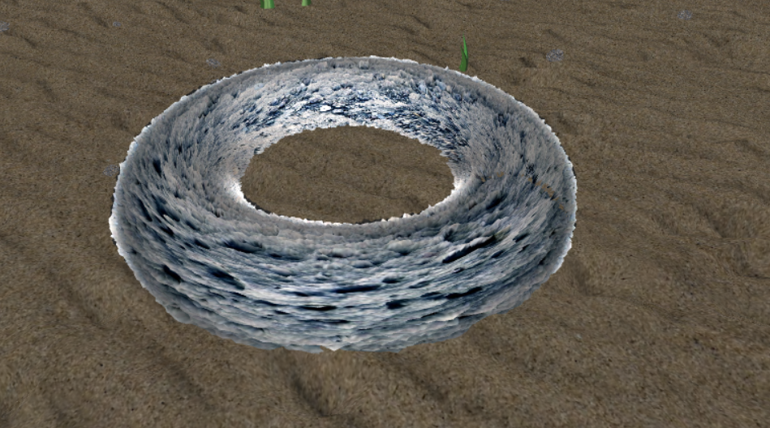
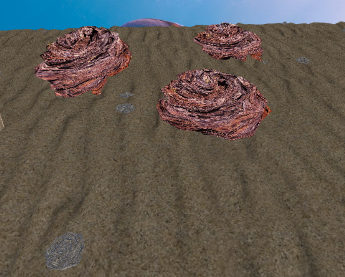
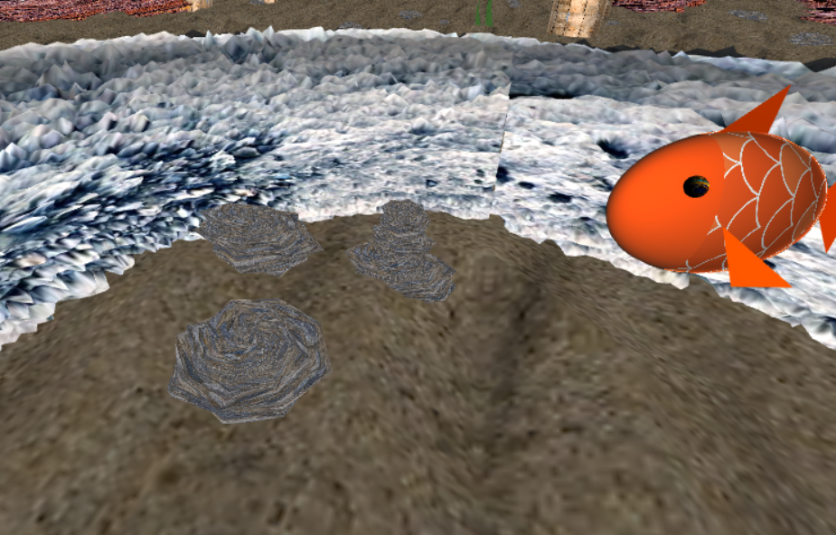

# CGRA 2020/2021

## Group T04G08

## Screenshots

### 1 - MyFish

### 2 - SeaFloor

### 3 - WaterSurface

### 4 - MyRock

### 5 - MyPillar

### 6 - End of part 5

### 7 - Rock pickup

### 8 - Additional features

