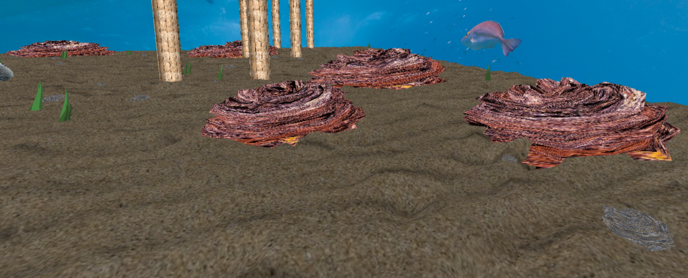

# CGRA 2020/2021

## Group T04G08
| Name             | Number    | E-Mail               |
| ---------------- | --------- | -------------------- |
| José Costa       | 201907216 | up201907216@fe.up.pt |
| Nuno Costa       | 201906272 | up201906272@fe.up.pt |

## Implemented Elements
- Moving fish (controled with keyboard, with modified shader and with behaviour aware animations)
- Bumped sea floor
- Ring shaped fish nest (with custom texture)
- Animated water surface
- Able to pick up rocks (able to be droped in the nest, with parabolic throw)
- Immovable rocks
- Pier pillars
-  6 different cubemaps to choose from
- Algae (with custom clusters and varying colors and sizes)

### Aditional features to be graded
- Animated algae (7.2)
- Rock placement in the nest (7.3)
- Parabolic rock throw (7.4)

## Screenshots
Updated screenshots accordingly to the final delivery. \
The screenshots used in the respective git tags represent the look achieved at that time; since then changes were made and it looks even prettier.

### 1 - MyFish

### 2 - SeaFloor

### 3 - WaterSurface

### 4 - MyRock

### 5 - MyPillar

### 6 - End of part 5

### 7 - Rock pickup

### 8 - Additional features

